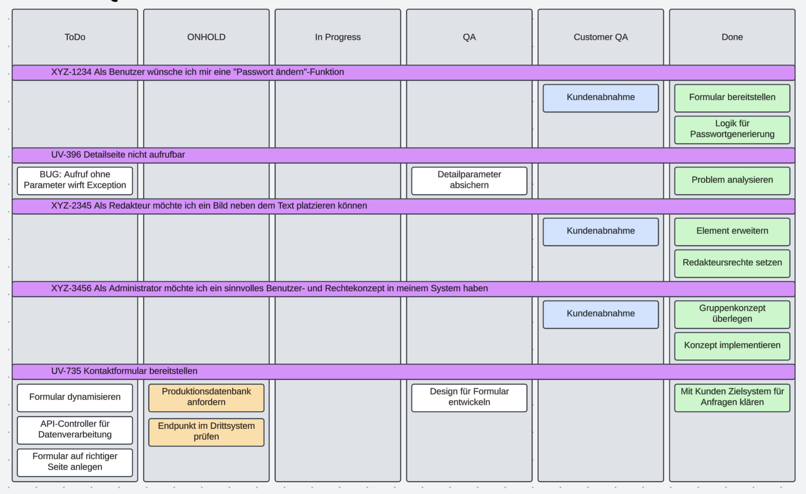
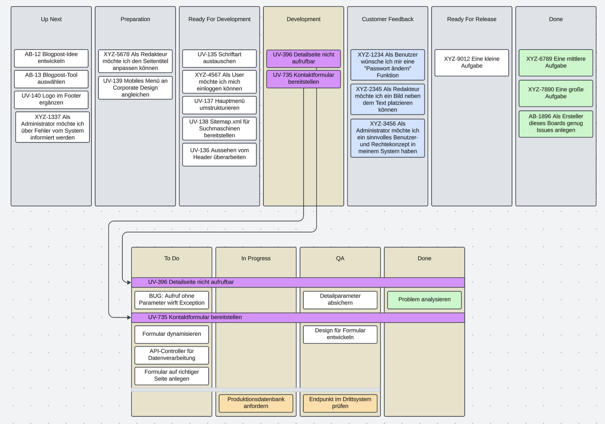

# Notizen
- Zielgruppe:
  - Recruiting
  - Kunden mit bisserl Verständnis

- Handwerkliches:
  - [x] 2–3 Grafiken

- Herleitung:
  - [x] Abbildung der Realität, da sind wir viel näher dran
  - [x] Entwicklung kommt aus dem Team
  - [x] Freiheit für die Veränderung bekommen
  - [x] dass man auch die Verantwortung dafür übernehmen wollte

- Direkte Folgen:
  - [x] man stolpert häufiger über kleine Probleme und Baustellen, findet die viel schneller
  - [x] Kommunikation ist improved, weil wir mehr über das Zusammenarbeiten sprechen (Kunde und untereinander), Gesprächsöffner
  - [x] Walk the board geht viel besser

- Ausblick:
  - [x] da ist kein Ende, es geht immer weiter mit dem Prozess
  - [x] kleinere / besser aufgeteilte Issues

# Draft: Gute catchy Überschrift finden, sowas wie z.B. "Board(r)evolution"
Schön, dass du dich für diesen Erfahrungsbericht interessierst. Im Kern geht es um Verantwortung und Freiheit, es geht um Unzufriedenheit und Frustration. Es geht vor allem um das Gefühl, dass wir als Team stark genug geworden sind, den nie enden wollenden Berg an auf uns einprasselnden Aufgaben guten Gewissens entgegentreten zu können, egal wie übermächtig groß ebenjener Berg auch mal scheinen vermag. Diese Reise ging über das letzte halbe Jahr und es hat uns mehr als nur einen Schritt nach vorne gebracht. :)

AND status NOT IN ("OBSOLET", "Done", "Ready For Release", "Customer Feedback")
Schön, dass du dich für diesen Erfahrungsbericht interessierst. Im Kern geht es um Verantwortung und Freiheit, es geht um Unzufriedenheit und Frustration. Es geht vor allem um das Gefühl, dass wir als Team stark genug geworden sind, den nie enden wollenden Berg an auf uns einprasselnden Aufgaben entgegentreten zu können, egal wie übermächtig groß ebenjener Berg auch mal scheinen vermag. Diese Reise ging über das letzte halbe Jahr und es hat uns mehr als nur einen Schritt nach vorne gebracht. :)

Der Startpunkt dieser Reise ist dabei so schlicht, dass kein Coach dieser Welt dazu eine Story auf Instagram posten würde: Wir haben unser Board umorganisiert, über das wir unsere Arbeit visualisieren. Die ganzen Effekte, die das aber mit sich bringt, haben wir alle zu Beginn nicht kommen sehen:
* wir können Stolpersteine und Probleme viel einfacher identifizieren
* wir sind offener und effektiver in unserer Kommunikation geworden
* unsere (täglichen) Abstimmungsmeetings sind drastisch effizienter geworden

## Unser Motor für Veränderung ist das Streben nach Einfachheit

Man kann es mit einer Zugfahrt vergleichen, die am Bahnhof Unzufriedenheit beginnt: Irgendwie finden wir alle die Art und Weise ineffektiv, wie wir kollaborativ unsere Aufgaben, Stories und Issues abarbeiten. Es schwelt diffus unter der Oberfläche, ohne dass wir es klar benennen können. Unsere Arbeit plätschert rein, wie sie es schon immer getan hat und unsere Visualisierung wurde irgendwann mal bestimmt und hat sich seitdem nicht großartig verändert. Mitarbeiter kommen und gehen, die Prozesse aber bleiben. Wir als Team haben beschlossen, dass wir aktiv werden und etwas verändern müssen. Das ist nicht einfach; schließlich gilt es, möglichst viele Köpfe mit zum Teil diametral zueinander liegenden Meinungen zu Kompromissen zu bewegen und letztlich unter einen Hut zu bekommen. Auf eine einende Tatsache können wir uns aber immer berufen: Wir wollen einen einfachen, am besten selbsterklärend-natürlichen Workflow, bei dem man sich nicht den Kopf zerbrechen muss.

# Ermittle unintuitive Verhaltensweisen



Während wir uns in Bewegung zum nächsten Halt setzen, müssen wir uns den Status Quo vor Augen führen. Die von uns abzuarbeitenden Aufgaben sind unterschiedlich groß: Mal müssen wir fünf Minuten Aufwand in die Umsetzung aufbringen, mal werden zwei Leute drei Wochen gebunden. Jede dieser Aufgaben wird vom Team in kleinere Häppchen (= Subtasks) aufgeteilt, damit wir strukturiert und planvoll die Aufgabe abarbeiten können. Das hat den positiven Nebeneffekt, dass bei mittlerem und größerem Aufgabenumfang bei sinnvoller Aufteilung prinzipiell mehr als nur eine Person parallel daran arbeiten kann. Diese kleinen Happen wandern durch die Spalten von links nach rechts. ```ToDo ``` ist das Sammelbecken für die noch zu erledigenden Tasks, die Karten in ```In Progress ``` werden gerade beackert und ```QA``` bedeutet, dass ein Kollege seine Arbeit geprüft haben möchte. Dann gibt es ```ONHOLD``` für Dinge, die gerade aus mannigfaltigen Gründen nicht weitergehen können. Wenn wir gerade auf eine Abnahme des Kunden für einzelne Dinge warten, kommt es in die Spalte ```Customer QA ```. Und am Ende ist alles ```Done```.

Dieses Board steht in mehreren Punkten im Widerspruch zu unserer gelebten Realität:
* der Kunde interessiert sich nicht für einzelne Bausteine, er will die Aufgabe in Summe abnehmen
* wir hatten keine Übersicht über unser Doing: Im Schnitt waren 15–20 Aufgaben auf dem Board, von denen die Hälfte auf die Abnahme des Kunden warteten, ein Viertel war blockiert und in ```ONHOLD```. Es wurde also nur ein Viertel der Aufgaben wirklich bearbeitet.
* Mechanismen wie WIP-Limit-Beschränkungen verpufften, weil wir nicht die tatsächliche Arbeit beschränkten, sondern die eigens ausgedachten Subtasks, die rein der Umsetzung dienen
* Aufgaben gingen nach dem Reinziehen auf das Board direkt auf ```ONHOLD```, weil wir uns erst mit der Aufgabe beschäftigten und somit erst dort Unklarheiten und zu klärende Probleme aufgefallen sind
* die einzelnen Subtasks müssen, sobald sie geblockt werden, gegen den Strom nach links verschoben werden und verlieren obendrein ihren Status
* den Zustand der Aufgabe kann man nur anhand des auf der Aufgabe gesetzten Status ermitteln, es gibt keine andere optische Zuordnung, was dazu führt, dass wir tagtäglich die Reihenfolge der Aufgaben auf dem Board dem jeweiligen Status anpassen mussten, damit eine Übersicht gegeben ist

## Mach dir die Welt, wie sie wirklich gelebt wird

Wir haben also den Bahnhof der Erkenntnis erreicht. Das bestehende Board läuft also an unseren Arbeitsweisen vorbei, hier steckt also ein gutes Improvement. Uns wurde von Leuchtfeuer das Vertrauen entgegebengebracht, frei in unserer Workflow-Gestaltung zu sein und können uns somit auf der grünen Wiese überlegen, wie wir unsere Arbeit sinnvoll organisieren. Der eine Weg ist, dass wir uns an das Board anpassen, was mutmaßlich der schwierige Weg ist. Der andere Weg ist, dass wir das Board an uns anpassen. Das hat den Nebeneffekt, dass wir unsere Workflows aktiv zu reflektieren beginnen. Das Outcome kann sich sehen lassen:



## Oh du schöne neue Zwei-Board-Welt

Der nächste Halt ist schon wenig später erreicht, denn die Umstrukturierung ließ sich in unserem Projekttool Jira schnell umsetzen. Die größte Veränderung war das Aufteilen in zwei Boards, die jeweils ihren eigenen Fokus haben. Beginnen wir mit dem **Developmentboard**, bei dem es sich um die Evolution aus der bis dato bestehenden Visualisierung handelt:

Die erste Vereinfachung ist das Streichen der Spalte ```Customer Feedback```: Diese Eigenschaft brauchen wir logisch betrachtet auf der Aufgabe, nicht auf unseren Subtasks. Die zweite Vereinfachung ist das Streichen der Spalte ```ONHOLD``` und das Integrieren dieses Zustands in die einzelnen anderen Spalten (exklusive ```Done```): Das führt dazu, dass ein Subtask seinen Zustand behält, aber gleichzeitig als geblockt markiert werden kann. Damit ist unser Umsetzungsboard in Handhabung und Übersicht drastisch verbessert.

Das zweite Board, unser Übersichtsboard, löst das Problem, dass uns der Gesamtüberblick über die Summe unserer Issues fehlt. Hier kommen links und rechts von unserer Umsetzung dem Kanbansprech nach nun der Up- und Downstream hinzu, der sich in folgende Spalten aufgliedert:

Für die Ebene der Aufgaben haben wir das zweite Board erfunden mit den Spalten, die unserem tatsächlichen Vorgehen entsprechen, das **Overviewboard**:
1. Die Aufgaben liegen zu Beginn nach Wichtigkeit vom PM (oder PO/Teamlead/…) sortiert in der ersten Spalte namens ```Up Next```.
2. Zu gegebener Zeit holen wir uns als Team ein Set an Aufgaben in ```Preparation``` und schauen uns diese an, bevor wir mit der tatsächlichen Umsetzung beginnen. Wir klären die für uns offenen Fragen und Unklarheiten, die während des Kunde-PM-Austauschs nicht aufgefallen sind. Somit sorgen wir dafür, dass wir die Aufgabe flüssig ohne Unterbrechungen umsetzen können.
3. Alles fertig Konzipierte wandert in die kommende Spalte ```Ready For Development```.
4. Wenn ein Teammitglied auf dem Umsetzungsboard nun keine Aufgabe findet, bedient er sich aus diesem Pool der vorbereiteten Aufgaben und zieht es sich in ```Development```. Die tatsächliche Arbeit findet hier dann auf dem Umsetzungsboard statt, auf dem nur noch die Elemente angezeigt werden, die sich auch tatsächlich in der Umsetzung befinden. Das sorgt für eine drastische Reduzierung und eine massiv verbesserte Übersicht über unser tatsächlich stattfindendes Doing und unterstützt somit alle täglichen Planungsmeetings. 
5. Wenn eine Aufgabe abgeschlossen ist, muss sie dem Kunden zur Abnahme übergeben werden. Die Karte wandert demzufolge in ```Customer Feedback``` und es in Kommunikation über das jeweils kundenindividuelle Medium getreten (E-Mail, Anruf, kundeneigenes Ticketsystem, …). Wichtig ist, dass wir aktiv die Bereitschaft zur Mitarbeit einfordern, die mindestens in einem Abnicken besteht. Je intensiver die Mitarbeit auf Kundenseite jedoch ist, desto besser ist das Resultat der Aufgabe. Bekommen wir jetzt Feedback, das eine Anpassungen benötigt, muss die Aufgabe unseren Zyklus über ```Preparation``` erneut durchlaufen, damit wir als Team uns aktiv vor Scope Creep schützen. Weil wir aber an die Devise "Menschen über Prozesse" glauben, kann bei objektiv feststellbaren Kleinigkeiten diese Regel aber auch übersprungen und ```Preparation``` umgangen werden.
6. Bekommen wir hingegen ein positives Feedback, wandert es weiter in ```Ready For Release```. Sie verweilen hier so lange, bis der Kunde die Aufgabe in das Produktionssystem ausgerollt haben möchte.
7. Wenn die Aufgabe dann abgeschlossen wurde, bleibt nur noch der Gang in die ```Done```-Spalte zu tun.

## Grenzen der Verantwortung schärfen

Wir mussten auf unserer Seite nach der Umstrukturierung lernen, dass einige Dinge außerhalb unserer Team-Verantwortung liegen. Unser Ziel ist, dass die Dinge von der ersten bis zur letzten Spalte schnell und unkompliziert durchfließen. Wir haben aber weder die linke Seite ("Upstream") noch die rechte Seite des Boards ("Downstream") unter unserer Kontrolle. Was bedeutet das?

Wir können kaum Einfluss auf die Dinge in ```Customer Feedback``` nehmen: Wann ein Kunde unsere fertiggestellten Aufgaben abnimmt, entscheidet allein er. Wenn es nach uns geht, am liebsten sofort. Aber es kann eben auch eine lange Zeit dauern. Ebenfalls kann es nach der Abnahme noch Wochen dauern, bis ein Feature tatsächlich in Production ankommt.

Begrenzt ist unser Einfluss als Umsetzer ebenfalls auf ```Up Next```: Wir können dafür sorgen, dass so viele Aufgaben wie möglich als Karte auf unserem Board erfasst werden. Das können interne Verbesserungen sein, es können Featurewünsche oder Bugmeldungen von unseren Kunden sein. Es kann sein, dass wir etwas per Anruf entgegennehmen, es kann uns auch eine Brieftaube erreichen. Je mehr Aufgaben gleichberechtigt auf dem Board eingepflegt werden, desto besser können sie unter- und zueinander priorisiert werden. Wenn jetzt aber kurzfristig Prioritäten umgeworfen werden, dann ist das jenseits unseres Einflusses.

Wir haben uns aber über die Boardanpassung die Möglichkeit geschaffen, dass wir flexibel auf solche Fälle reagieren können.

## Währet den Anfängen

Das Board ist nicht der eigentliche Grund für unseren Fortschritt. Die Umstellung der Visualisierung unserer Arbeit hat aber dafür gesorgt, dass wir uns bewusst und aktiv über unsere Prozesse auszutauschen. Unser Mindset hat sich geschärft dahingehend, dass jeder einzelne die (zumeist kleineren) Baustellen links und rechts von der täglichen Arbeit schneller identifizieren kann. Wir reden (und streiten) viel mehr über Probleme und überlegen uns sinnvolle Lösungen dafür, wie wir unser Leben noch einfacher gestalten können. Und wir können dank des übersichtlich-aktuellen Doings viel effektiver in unseren Abstimmungsmeetings **Walk The Board** einsetzen.

Die Endstation ist… es gibt keine Endstation: In regelmäßigen Meetings stellen wir den erreichten Status Quo auf den Prüfstand und schauen, wo wir den aktuellen Stand unseres Workflows aus- oder abbauen müssen. Routinen, die nicht mehr zu unserer Arbeitsweise passen, werden herausgestrichen. Wir haben Potenziale identifiziert darin, wie wir den Kunden aktiv an unserem Prozess teilhaben können. Andere Verbesserungen sind eine möglichst normalisierte Größe der Aufgaben oder eine Präzisierung der Spaltenübergangs-Definitionen. Es gibt immer etwas zu tun.
